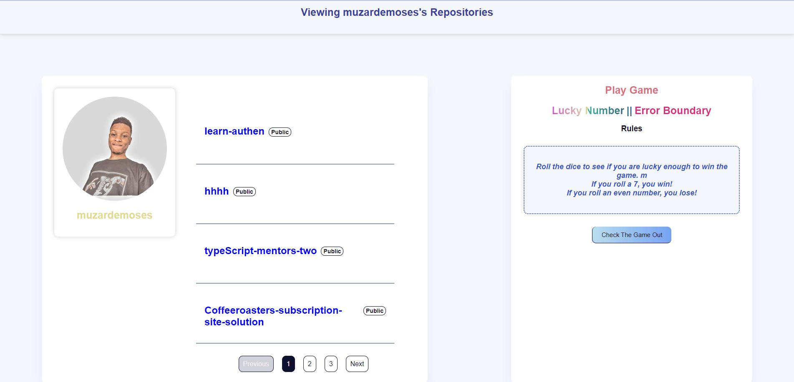

# AltSchool Africa - GitHub Repository

This is a solution to the [GitHub Repository Exam from AltSchool Africa](https://www.altschoolafrica.com/).

## Table of contents

- [Overview](#overview)
  - [The challenge](#the-challenge)
  - [Screenshot](#screenshot)
  - [Links](#links)
- [My process](#my-process)
  - [Built with](#built-with)
  - [What I learned](#what-i-learned)
  - [Continued development](#continued-development)
  - [Useful resources](#useful-resources)
- [Author](#author)
- [Acknowledgments](#acknowledgments)

## Overview

### The challenge

Users should be able to:

- View the optimal layout for the site depending on their device's screen size
- See hover states for all interactive elements on the page
- see the list of repositories from the [GitHub API](https://docs.github.com/en/rest/reference/repos#list-repositories-for-the-authenticated-user)

### Screenshot



### Links

- Solution URL: [GitHub Repository](https://github.com/muzardemoses/github-repo)
- Live Site URL: [Check Live Url](https://git-repo-muzarde.netlify.app/)

## My process

### Built with

- Semantic HTML5 markup
- CSS custom properties
- Flexbox
- CSS Grid
- Mobile-first workflow
- [React](https://reactjs.org/) - JS library

### What I learned

I learned how to use the GitHub API to fetch data from the API and display it on the page. I also learned how to use the React framework to build the application.

```js
const [repos, setRepos] = useState([]);
const [loading, setLoading] = useState(false);
const [error, setError] = useState(null);

useEffect(() => {
  setLoading(true);
  fetch("https://api.github.com/users/muzardemoses/repos")
    .then((res) => res.json())
    .then((data) => {
      setRepos(data);
      setLoading(false);
    })
    .catch((err) => {
      setError(err);
      setLoading(false);
    });
}, []);

{
  searchResults.map((movie) => (
    <div key={movie.id} className="flex flex-col gap-4">
      <h4>
        {movie.title} ({movie.release_date?.slice(0, 4)})
      </h4>
      
    </div>
  ));
}
```

```css
@media (prefers-color-scheme: dark) {
  body {
    background-color: hsl(235, 21%, 11%);
    color: hsl(234, 39%, 85%);
  }
}
```

### Continued development

I would like to continue learning React and improve my skills in it. I would also like to learn more about the GitHub API and how to use it to fetch data from it.

### Useful resources

- [React Documentation](https://reactjs.org/docs/getting-started.html) - This helped me to learn how to use React. I really liked this pattern and will use it going forward.

## Author

- GitHub - [@MuzardeMoses](https://github.com/MuzardeMoses)
- Frontend Mentor - [@muzardemoses](https://www.frontendmentor.io/profile/muzardemoses)
- Twitter - [@Muzarde1](https://www.twitter.com/Muzarde1)
- LinkedIn - [Moses Adebayo](https://www.linkedin.com/in/muzardemoses/)
- Instagram - [@muzardemoses](https://www.instagram.com/ademuzardemoses/)
- Facebook - [Adebayo MuzardeMoses Olaoluwa ](https://facebook.com/ademuzardemoses)
- YouTube - [MuzardeMoses](https://www.youtube.com/channel/UCg4W7cbWu6dW_8oJEHWaP9w)

## Acknowledgments

I want to thank [AltSchool Africa](https://www.altschoolafrica.com/) for giving me the opportunity to learn and improve my skills as a developer.
